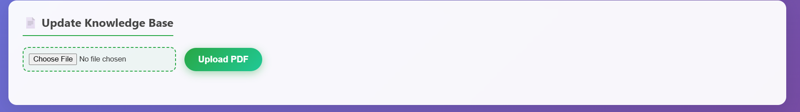

# 🤖 Realtime RAG-based Chatbot using ChromaDB, Mistral (GGUF), and Gemini API

A full-stack Retrieval-Augmented Generation (RAG) based chatbot system powered by **ChromaDB**, **Mistral 7B (GGUF)** for local LLM inference, and **Gemini API** for document summarization. The project features a custom HTML/CSS frontend with support for dynamic PDF upload and chatbot querying.

---

## 📁 Project Structure

Realtime_ChatBot/

│
├── backend/

│ ├── app.py # FastAPI backend API (serves chatbot) 
│ ├── chain.py # Core RAG logic (embedding + LLM response)
│ ├── ingest.py # Index and embed documents into ChromaDB
│
│

├── data/

│ └── pdfs/ # Initial PDF documents (ABB, Acer, Realme, etc.)
│ └──chromadb/ # create embeddings and main database

├── notebooks/

│ ├── chromadb # Custom chatbot UI
│ ├── experiments.ipynb # Tested and Debugging Code for chatbot
│
├── uploads/ # Uploaded PDF files for custom queries
├── models/ # Local Mistral model (.gguf format)
├── requirements.txt # Python dependencies
└── README.md # You are here!

---

## 💡 Features

- 📄 PDF ingestion and semantic chunking
- 🧠 ChromaDB as vector database (persistent)
- 💬 Local inference using **Mistral-7B-Instruct** `.gguf` via llama.cpp / ctransformers
- ☁️ Gemini API for PDF summarization during upload
- 🌐 FastAPI backend with REST endpoint
- 🎨 Custom HTML/CSS frontend interface
- 📎 Dynamic PDF Upload and Question Answering

---
##Working Website


You Can Add Custom PDFs and ask questions on given PDFs




## ⚙️ Setup Instructions

### 1. Clone the Repo

```bash
git clone https://github.com/your-username/realtime-rag-chatbot.git
cd realtime-rag-chatbot


2. Create and Activate Virtual Environment

python -m venv rag_env
rag_env\Scripts\activate   # Windows
# source rag_env/bin/activate   # Linux/Mac

3. Install Requirements

pip install -r requirements.txt


🧠 Ingest and Index PDF Manuals

python backend/ingest.py

This stores embeddings in persistent ChromaDB located in backend/chromadb.

🚀 Run the FastAPI Backend

uvicorn backend.app:app --reload

Visit FastAPI docs: http://localhost:8000/docs

Run the Frontend (HTML/CSS)

Simply open frontend/index.html in your browser.

You can serve it with a static server like VSCode Live Server or Python's HTTP server:

cd frontend
python -m http.server 5500

🔍 How it Works
RAG Pipeline
🧩 Embedding: all-MiniLM-L6-v2 from Sentence Transformers

📚 Storage: ChromaDB (persistent vector store)

🤖 LLM: mistralai/Mistral-7B-Instruct-v0.1 in .gguf format via ctransformers

💬 Response: Top-k relevant chunks + query passed to LLM for generation

📎 Gemini API: Used to summarize uploaded PDFs before ingestion

📤 PDF Upload + Gemini Summarization
Upload a PDF using the Upload Button in the frontend.

Gemini API extracts and summarizes content.

Summary is embedded and added to the ChromaDB vector store.


🧰 Tech Stack
Component----	Tool / Library
Embeddings---	sentence-transformers (MiniLM)
Vector DB---	ChromaDB
LLM Inference---	ctransformers with .gguf Mistral LLM
Summarization---	Google Gemini API
Backend API	FastAPI
Frontend---	HTML + CSS

📦 Dependencies
txt
Copy
Edit
fastapi
uvicorn
chromadb
ctransformers
sentence-transformers
PyMuPDF
requests
openai
python-dotenv

📌 Note: You must manually download the .gguf Mistral model and place it inside the models/ folder.


❓ Sample Queries

“what is Tempreture Description of Realme buds?”

“What is low water alarm?”

“How to reset a Dell Latitude laptop?”

🛠️ Troubleshooting
✅ Make sure ChromaDB directory exists before querying.

✅ Verify Mistral .gguf model path is correct in chain.py.

✅ Check tokenizer and generator are properly loaded with correct model path.

✅ If UI freezes, check browser console for network errors.

Contact
Made with ❤️ by Parth Dhone

For issues or suggestions, open a GitHub issue or email at "parthdhone53@gmail.com"

Github Link:https://github.com/parthdhone/RagChatbot.git


